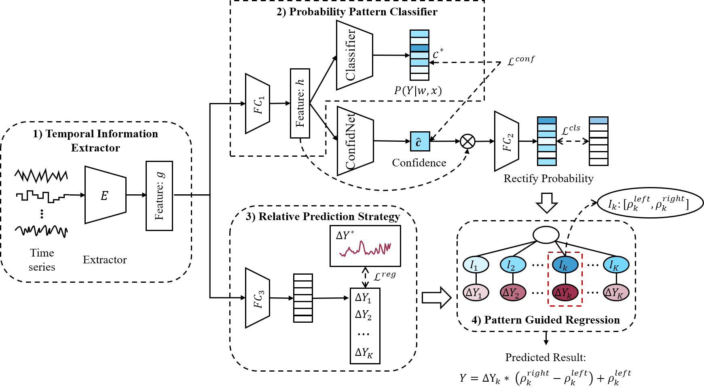

# PPGF: Probability Pattern-Guided Time Series Forecasting

## :sparkles: Abstract


Time series forecasting (TSF) is an essential branch of machine learning with various applications. Most methods for TSF focus on constructing different networks to extract better information and improve performance. 
However, practical application data contain different internal mechanisms, resulting in a mixture of multiple patterns. That is, the model's ability to fit different patterns is different and generates different errors. 
In order to solve this problem, we propose an end-to-end framework, namely **probability pattern-guided time series forecasting (PPGF)**. 
PPGF reformulates the TSF problem as a forecasting task guided by probabilistic pattern classification. 
Firstly, we propose the grouping strategy to approach forecasting problems as classification and alleviate the impact of data imbalance on classification. Secondly, we predict in the corresponding class interval to guarantee the consistency of classification and forecasting. In addition, True Class Probability (TCP) is introduced to pay more attention to the difficult samples to improve the classification accuracy. Detailedly, PPGF classifies the different patterns to determine which one the target value may belong to and estimates it accurately in the corresponding interval. 
To demonstrate the effectiveness of the proposed framework, we conduct extensive experiments on real-world datasets, and PPGF achieves significant performance improvements over several baseline methods. Furthermore, the effectiveness of TCP and the necessity of consistency between classification and forecasting are proved in the experiments.

## :sparkles: How to Run the Code:

1. Install Python 3.10, PyTorch 2.5.1.
2. Install necessary dependencies.
```bash
pip install -r requirements.txt
```
3. Train and evaluate the model. Now you can run the code by:
```bash
CUDA_VISIBLE_DEVICES=0 python -u main.py --lr 0.0001 --input_length 27 --predict_length 2 --epoch 60 --num_groups 2 --lambda_reg 4 --hidden_dim 200 |tee ./log.txt
```

## 📚: Citation
If you find this repo useful, please cite our paper.
```bash
@article{sun2025ppgf,
  title={PPGF: Probability Pattern-Guided Time Series Forecasting},
  author={Sun, Yanru and Xie, Zongxia and Xing, Haoyu and Yu, Hualong and Hu, Qinghua},
  journal={IEEE Transactions on Neural Networks and Learning Systems},
  year={2025},
  publisher={IEEE}
}
```
